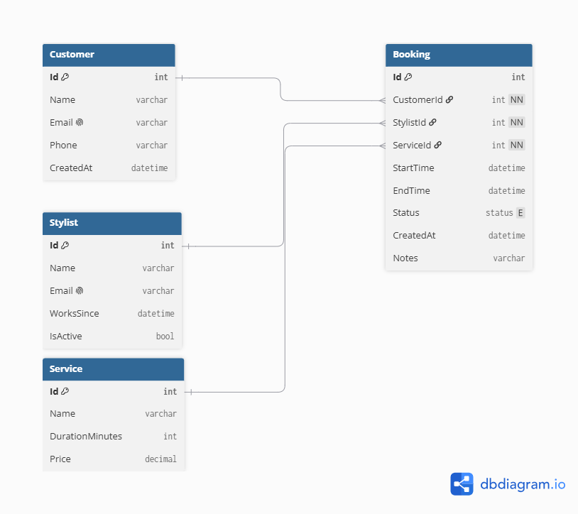

# Database Design

## Background

This project grew out of conversations I had with my mentor Daniel about building a product around a real problem, not a generic idea. One example he gave was that a hairdresser could benefit from seeing her booking patterns over time — for instance, understanding why certain time slots are consistently quiet — without needing to change how she works. That got me thinking about building a booking system that doesn't just handle bookings, but also surfaces that kind of insight.

## The Tables

The system has four main tables: Customer, Stylist, and Service represent the three "things" a booking connects, while Booking is the central table where everything comes together. I designed it around Booking because that's where the interesting data lives — it's by analyzing bookings (rather than customers or services on their own) that patterns actually become visible.

## Decisions I Made

I made Status an enum (Confirmed, Cancelled, Completed) instead of free text, since free text easily becomes inconsistent — "done", "Completed", "finished" could all mean the same thing but get counted as different values during analysis. I also added IsActive to Stylist instead of deleting stylists who leave, since their historical bookings still need to exist. CustomerId, StylistId, and ServiceId are all set to NOT NULL because a booking doesn't make sense without all three.

## Next Steps

Next I'm building basic CRUD endpoints for Customer, Stylist, and Service, then the more complex booking logic (including preventing double-bookings), and finally an analytics endpoint that surfaces booking patterns over time.